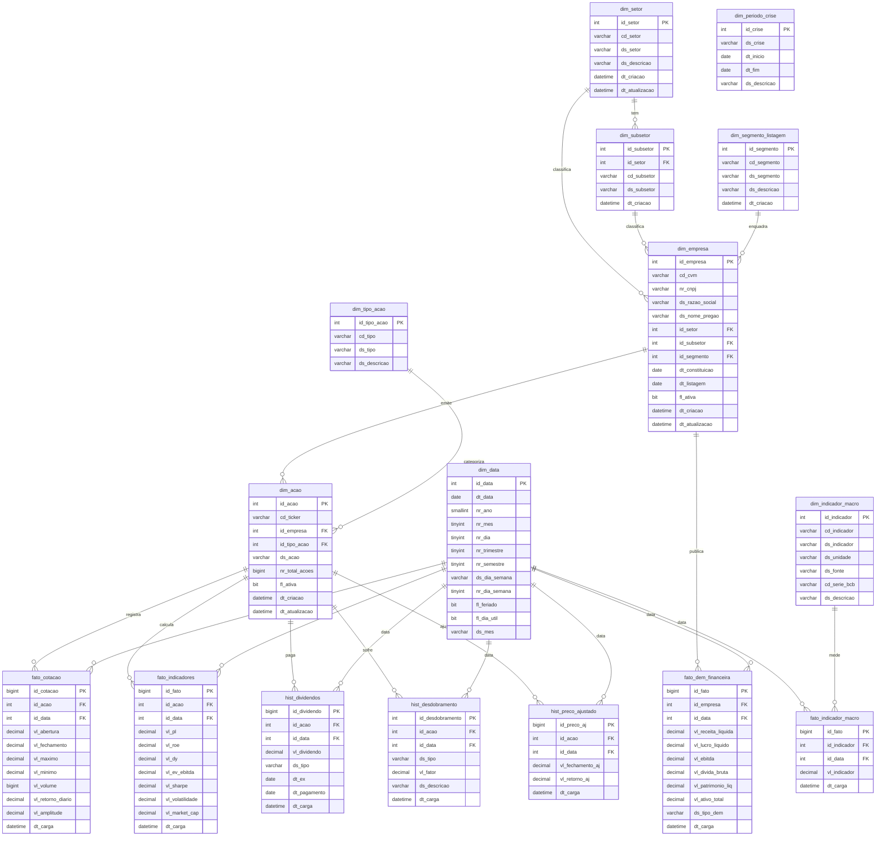

# Análise do Mercado Financeiro Brasileiro — B3 × Macro × CVM

> Perguntas analíticas que cruzam dados macroeconômicos do Banco Central, demonstrações financeiras da CVM e séries históricas de preços da B3.

---

## Grupo

| Nome | Responsabilidade |
|------|-----------------|
| Lucas Rodrigues Alves | Líder — Arquiteto de Dados (DDL, DER, constraints) |
| Lucas Oliveira Martins | Engenheiro de ETL (extração, transformação, carga, SPs analíticas) |
| Ailton Santos Dantas | Analista de Dados (Views, índices, functions) |
| Luigi Sapucaia de Lima | Desenvolvedor SQL (Triggers, DCL roles) |
| Rubens Manoel | Segurança & Docs (DCL roles, dicionário, manual) |

---

## Como Executar o Projeto (passo a passo)

### Pré-requisitos

- SQL Server 2019+ com SSMS instalado
- Acesso à internet para baixar os CSVs
- Permissão `BULKADMIN` no servidor SQL (necessária para BULK INSERT)

---

### PASSO 1 — Criar a estrutura do banco (DDL)

Abra o SSMS, conecte ao servidor e execute:

```sql
-- Arquivo: 01_ddl/01_ddl_mercado_financeiro.sql
-- Cria o banco MercadoFinanceiro, todas as tabelas, índices e dados iniciais
```

---

### PASSO 2 — Baixar os arquivos CSV

Crie a pasta `C:\dados\mercado_financeiro\` no servidor SQL e baixe os 5 arquivos:

| Arquivo esperado | Fonte | Como baixar |
|---|---|---|
| `cotacoes.csv` | Kaggle | Instale a CLI: `pip install kaggle` → `kaggle datasets download -d felsal/ibovespa-stocks` |
| `selic.csv` | BCB SGS série 11 | Acesse: `https://api.bcb.gov.br/dados/serie/bcdata.sgs.11/dados?formato=csv` |
| `ipca.csv` | BCB SGS série 433 | Acesse: `https://api.bcb.gov.br/dados/serie/bcdata.sgs.433/dados?formato=csv` |
| `cambio.csv` | BCB SGS série 1 | Acesse: `https://api.bcb.gov.br/dados/serie/bcdata.sgs.1/dados?formato=csv` |
| `cad_empresas.csv` | CVM | Acesse: `https://dados.cvm.gov.br/dados/CIA_ABERTA/CAD/DADOS/cad_cia_aberta.csv` |

**Colunas esperadas:**

- `cotacoes.csv`: `ticker, date, open, close, high, low, volume`
- `selic.csv`, `ipca.csv`, `cambio.csv`: `data;valor` (separador ponto-e-vírgula)
- `cad_empresas.csv`: `CD_CVM;CNPJ_CIA;DENOM_SOCIAL;DENOM_COMERC;SIT;SETOR_ATIV;...`

---

### PASSO 3 — Executar o ETL

Abra o arquivo `02_etl/01_extract_staging.sql` no SSMS e ajuste o caminho dos arquivos CSV se necessário. Em seguida execute o pipeline:

```sql
USE MercadoFinanceiro;
GO

-- Executa as 3 etapas: extract → transform → load
EXEC dbo.usp_etl_executar_pipeline;
```

Se o pipeline não existir ainda, execute as SPs individualmente na ordem:

```sql
EXEC dbo.usp_etl_01_extract  @base_path = 'C:\dados\mercado_financeiro\';
EXEC dbo.usp_etl_02_transform;
EXEC dbo.usp_etl_03_load;
```

---

### PASSO 4 — Validar a carga (obrigatório — tirar print)

```sql
USE MercadoFinanceiro;
GO

-- Contagem total (alvo: 200.000+ registros)
SELECT COUNT(*) AS total_registros FROM dbo.fato_cotacao;

-- Verificação por ticker
SELECT da.cd_ticker, COUNT(*) AS pregoes
FROM dbo.fato_cotacao fc
INNER JOIN dbo.dim_acao da ON da.id_acao = fc.id_acao
GROUP BY da.cd_ticker
ORDER BY pregoes DESC;

-- Log de erros (deve estar vazio)
SELECT TOP 20 * FROM dbo.log_erros_etl ORDER BY dt_erro DESC;
```

O script completo de validação está em: `03_dql/01_validacao_pos_etl.sql`

---

### PASSO 5 — Criar as Stored Procedures analíticas

```sql
-- SP1: Selic vs retorno das ações financeiras (Q1)
-- Arquivo: 05_stored_procedures/usp_selic_vs_retorno_financeiras.sql

-- SP2: Empresas resilientes na COVID-2020 (Q2)
-- Arquivo: 05_stored_procedures/usp_empresas_resilientes_covid.sql
-- ⚠️ Requer fn_retorno_acumulado (06_functions — Ailton)
```

Teste as SPs após criar:

```sql
EXEC dbo.usp_selic_vs_retorno_financeiras @dt_inicio = '2018-01-01', @dt_fim = '2023-12-31';
EXEC dbo.usp_empresas_resilientes_covid;
```

---

### PASSO 6 — Demais objetos (outros membros)

| Pasta | Objeto | Responsável |
|-------|--------|-------------|
| `04_views/` | Views analíticas | Ailton |
| `06_functions/` | `fn_retorno_acumulado` e outras | Ailton |
| `07_triggers/` | Triggers de auditoria | Luigi |
| `08_dcl/` | Roles e permissões | Luigi |
| `09_documentacao/` | Dicionário de dados | Luigi / Rubens |

---

## Estrutura do Repositório

```
Mercado-Financeiro/
├── README.md
├── 01_ddl/
│   └── 01_ddl_mercado_financeiro.sql      # Cria banco, tabelas, índices
├── 02_etl/
│   └── 01_extract_staging.sql             # Pipeline ETL (extract → transform → load)
├── 03_dql/
│   └── 01_validacao_pos_etl.sql           # Validações pós-carga + teste das SPs
├── 04_views/                              # Views analíticas (Ailton)
├── 05_stored_procedures/
│   ├── usp_selic_vs_retorno_financeiras.sql  # Q1 — Selic vs Financeiras
│   └── usp_empresas_resilientes_covid.sql    # Q2 — Resiliência COVID-2020
├── 06_functions/                          # fn_retorno_acumulado (Ailton)
├── 07_triggers/                           # Triggers (Luigi)
├── 08_dcl/                                # Roles e permissões (Luigi)
├── 09_documentacao/                       # Dicionário de dados
└── 10_dados/                              # CSVs de exemplo
```

---

## Fontes de Dados

| Fonte | Dado | URL |
|-------|------|-----|
| Banco Central (BCB) | Selic diária | https://api.bcb.gov.br/dados/serie/bcdata.sgs.11/dados?formato=csv |
| Banco Central (BCB) | Câmbio USD/BRL | https://api.bcb.gov.br/dados/serie/bcdata.sgs.1/dados?formato=csv |
| Banco Central (BCB) | IPCA mensal | https://api.bcb.gov.br/dados/serie/bcdata.sgs.433/dados?formato=csv |
| CVM | Demonstrações Financeiras (DFP) | https://dados.cvm.gov.br/dados/CIA_ABERTA/DOC/DFP/DADOS/ |
| CVM | Cadastro de Empresas | https://dados.cvm.gov.br/dados/CIA_ABERTA/CAD/DADOS/ |
| B3 via Kaggle | Preços e Volume histórico | https://www.kaggle.com/datasets/felsal/ibovespa-stocks |

---

## Perguntas Analíticas

### Q1 — Selic vs. Retorno de Ações Financeiras
**Pergunta:** Empresas do setor financeiro superam a Selic em janelas de alta de juros?
**SP:** `dbo.usp_selic_vs_retorno_financeiras`

### Q2 — Empresas Resilientes na COVID-2020
**Pergunta:** Quais empresas e setores foram mais resilientes durante a crise de 2020?
**SP:** `dbo.usp_empresas_resilientes_covid`

### Q3 — Volume vs. Volatilidade por Setor
**Pergunta:** Setores com maior volume médio têm menor volatilidade histórica?

### Q4 — Câmbio vs. Exportadoras
**Pergunta:** Exportadoras se valorizam consistentemente quando o dólar sobe?

### Q5 — Risco-Retorno por Segmento de Listagem
**Pergunta:** Novo Mercado oferece melhor Sharpe do que o Mercado Tradicional?

---

## Diagrama Entidade-Relacionamento


