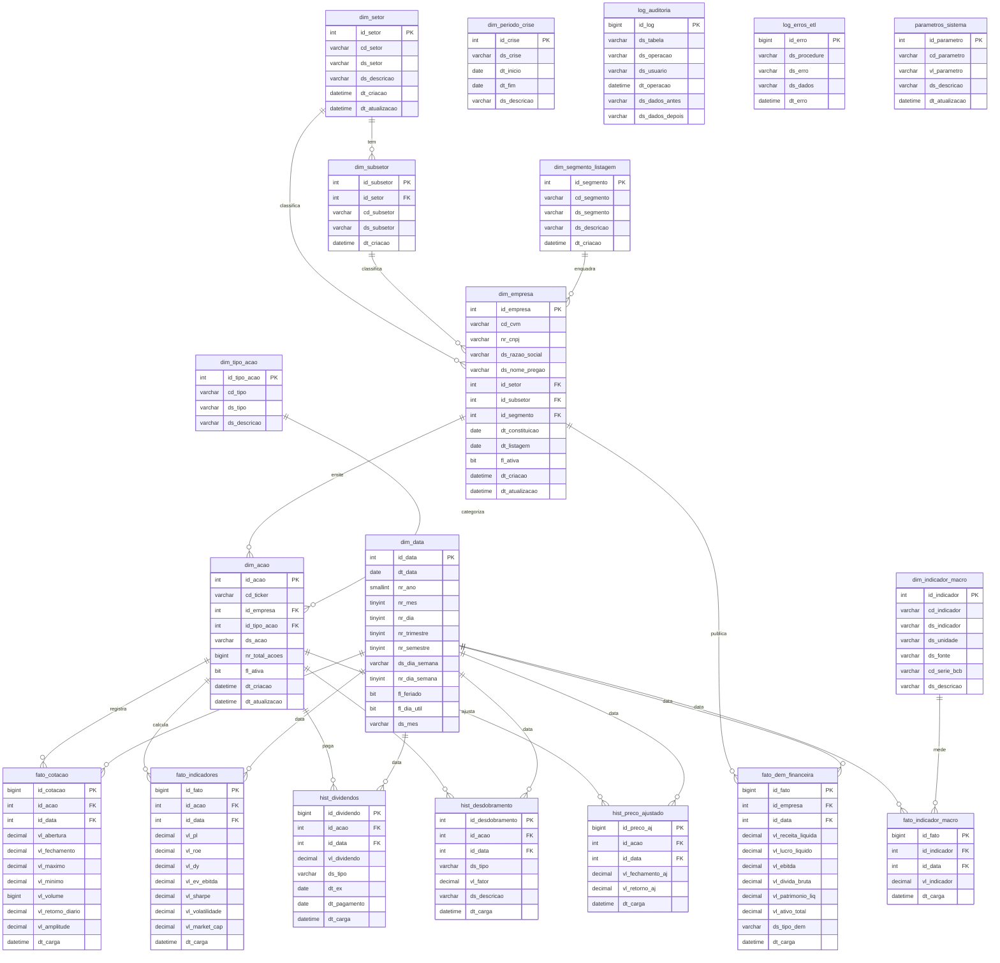

# 📊 Análise do Mercado Financeiro Brasileiro — B3 × Macro × CVM

> Perguntas analíticas que cruzam dados macroeconômicos do Banco Central, demonstrações financeiras da CVM e séries históricas de preços da B3.

---

## 👥 Grupo

| Nome | Responsabilidade |
|------|-----------------|
| Lucas Rodrigues Alves | Líder — Arquiteto de Dados (DDL, DER, constraints) |
| Lucas Oliveira Martins | Engenheiro de ETL (extração, transformação, carga) |
| Ailton Santos Dantas | Analista de Dados (Views, índices, SPs analíticas) |
| Luigi Sapucaia de Lima | Desenvolvedor SQL (Functions, Triggers) |
| Rubens Manoel | Segurança & Docs (DCL roles, dicionário, manual) |

---

## 🗂️ Fontes de Dados

| Fonte | Dado | Link |
|-------|------|------|
| Banco Central (BCB) | Selic diária | https://api.bcb.gov.br/dados/serie/bcdata.sgs.11/dados?formato=csv |
| Banco Central (BCB) | Câmbio USD/BRL | https://api.bcb.gov.br/dados/serie/bcdata.sgs.1/dados?formato=csv |
| Banco Central (BCB) | IPCA mensal | https://api.bcb.gov.br/dados/serie/bcdata.sgs.433/dados?formato=csv |
| CVM | Demonstrações Financeiras (DFP) | https://dados.cvm.gov.br/dados/CIA_ABERTA/DOC/DFP/DADOS/ |
| CVM | Cadastro de Empresas | https://dados.cvm.gov.br/dados/CIA_ABERTA/CAD/DADOS/ |
| B3 via Kaggle | Preços e Volume histórico (Ibovespa) | https://www.kaggle.com/datasets/felsal/ibovespa-stocks |

---

## 📊 Diagrama Entidade-Relacionamento



---

## ❓ Perguntas Analíticas

### Q1 — Selic vs. Retorno de Ações Financeiras

**Pergunta:** Empresas do setor financeiro superam a Selic em janelas de alta de juros ou apenas a replicam?

**Hipótese:** Bancos e seguradoras tendem a ampliar margens durante ciclos de alta da Selic (spread bancário cresce), mas papéis de crescimento sofrem compressão de múltiplo. A pergunta separa quais subsetores financeiros têm beta positivo vs. negativo à taxa básica.

**Dados necessários:**
- Selic diária → `BCB SGS 11`: https://api.bcb.gov.br/dados/serie/bcdata.sgs.11/dados?formato=csv
- Preços históricos B3 → `Kaggle`: https://www.kaggle.com/datasets/felsal/ibovespa-stocks

---

### Q2 — Empresas Resilientes na COVID-2020

**Pergunta:** Quais empresas listadas na B3 apresentaram crescimento de receita e lucro durante a crise de 2020, e o que elas têm em comum?

**Hipótese:** Empresas resilientes em 2020 concentram-se em tech, saúde, varejo digital e agro. O cruzamento com DFP permite calcular o CAGR 2019–2021 e identificar padrões de setor, estrutura de capital e governança que explicam a resiliência.

**Dados necessários:**
- DFP receita/lucro → `CVM`: https://dados.cvm.gov.br/dados/CIA_ABERTA/DOC/DFP/DADOS/
- Cadastro de empresas → `CVM`: https://dados.cvm.gov.br/dados/CIA_ABERTA/CAD/DADOS/

---

### Q3 — Volume vs. Volatilidade por Setor

**Pergunta:** Setores com maior volume médio de negociação têm menor volatilidade histórica de preços, ou o volume é movido justamente pelos eventos de alta volatilidade?

**Hipótese:** A relação volume-volatilidade não é linear: setores de utilities têm volume moderado e baixa volatilidade, enquanto commodities têm alto volume E alta volatilidade.

**Dados necessários:**
- Preços e volume → `Kaggle`: https://www.kaggle.com/datasets/felsal/ibovespa-stocks
- Setor das empresas → `CVM`: https://dados.cvm.gov.br/dados/CIA_ABERTA/CAD/DADOS/

---

### Q4 — Câmbio vs. Exportadoras

**Pergunta:** Ações de exportadoras (agro, mineração, papel & celulose) se valorizam de forma consistente quando o dólar sobe acima de determinado threshold?

**Hipótese:** Existe um ponto de inflexão do câmbio (por volta de R$ 5,50–6,00) a partir do qual a valorização cambial passa a gerar retorno anormal positivo nas exportadoras.

**Dados necessários:**
- Câmbio USD/BRL → `BCB SGS 1`: https://api.bcb.gov.br/dados/serie/bcdata.sgs.1/dados?formato=csv
- Setor das empresas → `CVM`: https://dados.cvm.gov.br/dados/CIA_ABERTA/CAD/DADOS/

---

### Q5 — Risco-Retorno por Segmento de Listagem

**Pergunta:** Empresas no Novo Mercado oferecem melhor relação risco-retorno (Sharpe) do que as do Mercado Tradicional ao longo de 5+ anos?

**Hipótese:** A tese do "prêmio de governança" sugere que Novo Mercado = menor custo de capital = múltiplos maiores = menor volatilidade relativa.

**Dados necessários:**
- Segmento de listagem → `CVM`: https://dados.cvm.gov.br/dados/CIA_ABERTA/CAD/DADOS/
- Preços históricos → `Kaggle`: https://www.kaggle.com/datasets/felsal/ibovespa-stocks

---

### Q6 — Concentração de Volume por Setor

**Pergunta:** A concentração do volume financeiro diário na B3 em poucos setores e empresas aumentou nos últimos anos, e quais setores perderam participação relativa?

**Hipótese:** Setor financeiro (ITUB, BBDC, BBAS) e commodities (VALE, PETR) dominam mais de 60% do volume.

**Dados necessários:**
- Volume diário → `Kaggle`: https://www.kaggle.com/datasets/felsal/ibovespa-stocks
- Setor das empresas → `CVM`: https://dados.cvm.gov.br/dados/CIA_ABERTA/CAD/DADOS/

---

### Q7 — Dividendos por Setor

**Pergunta:** Setores de energia elétrica e saneamento lideram yield de dividendos histórico, e o dividend yield prediz retorno total nos 12 meses seguintes?

**Hipótese:** High-yield de dividendos é geralmente contracíclico: quando a Selic cai, ações de dividendos sobem por compressão de prêmio.

**Dados necessários:**
- Dividendos → `CVM DFP`: https://dados.cvm.gov.br/dados/CIA_ABERTA/DOC/DFP/DADOS/
- Preços históricos → `Kaggle`: https://www.kaggle.com/datasets/felsal/ibovespa-stocks

---

### Q8 — IPCA vs. Setor de Consumo

**Pergunta:** Surpresas de IPCA acima do teto da meta historicamente geram retorno negativo anormal nas ações de consumo discricionário no mês seguinte?

**Hipótese:** Consumo discricionário sofre duplo impacto de inflação: margem comprimida por custos + queda de demanda real.

**Dados necessários:**
- IPCA mensal → `BCB SGS 433`: https://api.bcb.gov.br/dados/serie/bcdata.sgs.433/dados?formato=csv
- Ações de consumo → `Kaggle`: https://www.kaggle.com/datasets/felsal/ibovespa-stocks

---

### Q9 — Liquidez vs. Tamanho de Empresa

**Pergunta:** Existe uma relação não-linear entre o tamanho da empresa (total de ações emitidas × preço) e a liquidez diária?

**Hipótese:** Large-caps têm alta liquidez institucional constante. Small-caps têm liquidez episódica. A faixa mid-cap é a mais sensível a ciclos de risk-on/off.

**Dados necessários:**
- Volume de ações → `Kaggle`: https://www.kaggle.com/datasets/felsal/ibovespa-stocks
- Total de ações emitidas → `CVM`: https://dados.cvm.gov.br/dados/CIA_ABERTA/CAD/DADOS/

---

## 🔗 Correlações entre Perguntas

| Pergunta | Conecta com |
|----------|-------------|
| Q1 | Q7, Q8 |
| Q2 | Q5, Q7 |
| Q3 | Q6, Q9 |
| Q4 | Q1, Q8 |
| Q5 | Q2, Q9 |
| Q6 | Q3, Q7 |
| Q7 | Q1, Q2 |
| Q8 | Q1, Q4 |
| Q9 | Q3, Q5, Q6 |

---

## 🗃️ Estrutura do Repositório

```
📁 Mercado-Financeiro/
├── 📄 README.md
├── 📁 01_ddl/           # Scripts de criação das tabelas
├── 📁 02_etl/           # Scripts de carga e transformação
├── 📁 03_dql/           # Queries analíticas
├── 📁 04_views/         # Views
├── 📁 05_stored_procedures/  # Stored Procedures
├── 📁 06_functions/     # Functions
├── 📁 07_triggers/      # Triggers
├── 📁 08_dcl/           # Roles e permissões
├── 📁 09_documentacao/  # Dicionário de dados, DER
└── 📁 10_dados/         # Dados de exemplo
```

---

## 🛠️ Como Executar

1. Clone o repositório
2. Abra o DBeaver e conecte no SQL Server
3. Execute `01_ddl/01_ddl_mercado_financeiro.sql`
4. Execute os scripts de ETL em `02_etl/`
5. Verifique os dados com as queries em `03_dql/`